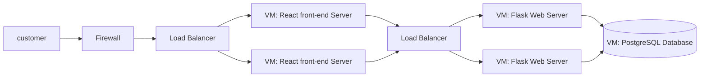
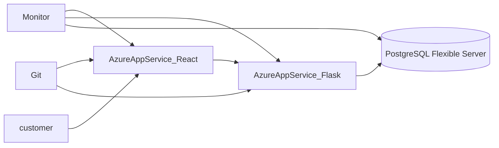

### Instructions

Scenario: The following application consists of a Web Server written in Flask. A UI front end written in React. A database layer consisting of Postgres.

1. Describe how this application can be deployed in the cloud using IaaS infrastructure

   

   When using IaaS infrastructure, we purchase VMs, IPs, firewall services and load balancer from cloud providers. This web service is deployed on different VMs provided by cloud providers. We need to manage the OS and the VMs.

   There'll be a load balancer and a firewall from cloud provider deployed between customer end and React front-end server, and another load balancer deployed between React front end and Flask backend.

   The React front-end service should be deployed on several VMs, with it's dependencies.

   The Flask back-end service should be deployed on several VMs, with it's python dependencies.

   The PostgreSQL Database should be deployed on a separate VM.

2. Describe how this application can be deployed in the cloud using PaaS infrastructure.

​	When using PaaS services, Azure has its Azure App Service to host web services and its Azure Database for PostgreSQL Flexible Server.

​	We can use git to deploy our React service and Flask service to Azure App Service.

​	We can use Azure‘s PostgreSQL Flexible Server to hold our PostgreSQL.

​	A monitor service from service provider should be add to each component.

