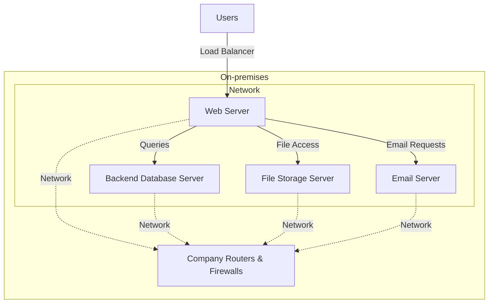
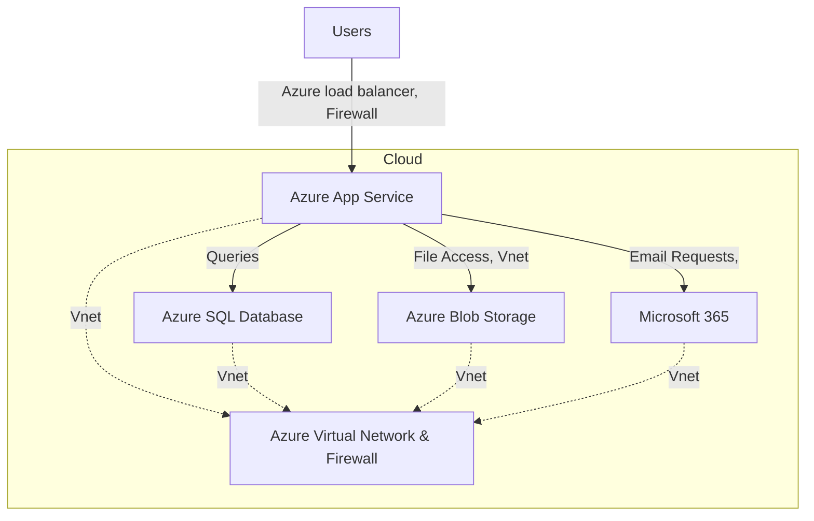

# On-Premises Solution Design

## **Overview**

A mid-sized retail company currently operates a traditional on-premises IT infrastructure consisting of the following components:

- **Web Application**

This web application should be using a monolithic architecture, hosted on physical servers (VMs) within the company’s data center. It needs manual scaling and maintenance, so at least there's a maintenance team to look after it. As it runs on-premises, it lacks fault tolerance and disaster recovery.

- **Backend Database**

Assume the backend database is using a SQL server (VM), also hosted on physical servers. It needs manual patching and maintenance.

- **File Storage**

Files are stored on a local file system that runs on a server (VM). It has limited redundancy and scalability. Also needs to manually back up to external storage devices.

- **Networking Infrastructure**

Runs on on-premises firewalls, routers, and switches which are managed by the maintenance team. Lack of redundancy and cloud-level stability.

- **Email Services**

This email server is hosted and managed by an in-house email server. This service also requires manual configuration and security management. It has limited scalability and reliability.

## **Migration Fit: PaaS, IaaS, or SaaS**

The following table categorizes each component based on its optimal cloud migration approach:

| Component        | Migration Fit | Cloud Offering                                       |
| ---------------- | ------------- | ---------------------------------------------------- |
| Web Application  | IaaS          | Virtual Machines                                     |
| Backend Database | PaaS          | Azure SQL Database                                   |
| File Storage     | PaaS          | Azure Blob Storage                                   |
| Networking       | Cloud-native  | Azure Virtual Network, Azure Firewall, Load balancer |
| Email Service    | SaaS          | Microsoft 365                                        |

# Migration Strategies

I plan to use a Hybrid measure to migrate all these services, to IaaS, PaaS and SaaS. The strategies for each component are as follows:

### **1. Web Application Migration**

- **Choice**: Virtual Machines (IaaS) (Lift and Shift)
- **Reason**: Lift and Shift the web app from the on-premises VM to Azure Virtual Machine will cause the least change to our application which could lead to unknown issues. This will reduce the pressure on the development team and maintenance team.
- **Steps**:
  1. Assess application dependencies and local server's configurations.
  2. Migrate to VMs for Lift and Shift.
  3. Set up auto-scaling and load balancing.
  4. Conduct testing and deployment.

### **2. Database Migration**

- **Choice**: Azure SQL Managed Instance (PaaS)
- **Reason**: Azure offers an "Azure Database Migration Service" to migrate on-premises SQL Server databases directly to Azure SQL Database after some necessary assessments. When using Azure SQL Managed Instance, there will be better reliability and don't need to maintain the infrastructure.
- **Steps**:
  1. Run an assessment of source SQL Server databases
  2. Collect performance data from source SQL Server instance
  3. Get a recommendation of the Azure SQL Database SKU that will work best for your workload
  4. Create an instance of Azure Database Migration Service
  5. Start your migration and monitor progress to completion

### **3. File Storage Migration**

- **Choice**: Azure Blob Storage
- **Reason**: Azure Blob Storage is a scalable and cost-effective solution for migrationg on-premises file storage with high scalability and availability, better security and compliance, automated backup and recovery. Also because it is integrated with Azure services, making it easier to work with other Azure-based services.
- **Steps**:
  1. Assess file storage structure.
  2. Migrate data using Azure Storage Migration tools.
  3. Implement access control and security policies.

### **4. Networking Migration**

- **Choice**: Azure Virtual Network (VNet), Azure Firewall, Azure VPN Gateway, Azure Load Balancer
- **Reason**: We must use Azure's network service when using their VM, file storage and databases, because they're running on the cloud. We can easily create load balancer, VPN service, firewall and network policy with Azure's service, and we don't need to worry the stability and cost of infrastructure maintenance. 
- **Steps**:
  1. Set up Azure VNet and establish VPN connectivity.
  2. Configure firewalls and security groups.
  3. Deploy load balancer for VM in different reigions and zones.

### **5. Email Service Migration**

- **Choice**: Microsoft 365
- **Reason**: As a mid-sized company, we don't need to maintain our own email service as it is costly for both hardware and human resource. Directly using email SaaS from service provider is convenient and cost-saving.
- **Steps**:
  1. Migrate email accounts to Microsoft 365.

## **Final Migration Plan**

| Step | Task                   | Migration Type    | Target Service                           |
| ---- | ---------------------- | ----------------- | ---------------------------------------- |
| 1    | Web App Migration      | Lift and Shift    | Azure VM                                 |
| 2    | Database Migration     | Refactor          | Azure SQL Database                       |
| 3    | File Storage Migration | Rehost            | Azure Blob Storage / Azure Files         |
| 4    | Networking             | Cloud-native      | Azure VNet, Firewall, VPN, Load balancer |
| 5    | Migrate Email          | Replace with SaaS | Microsoft 365                            |

