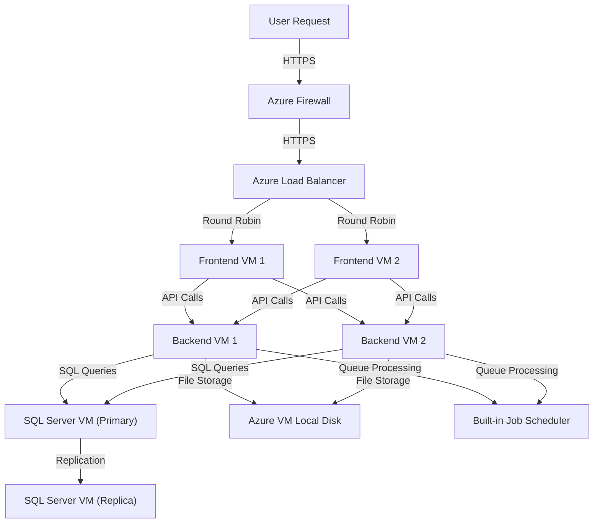
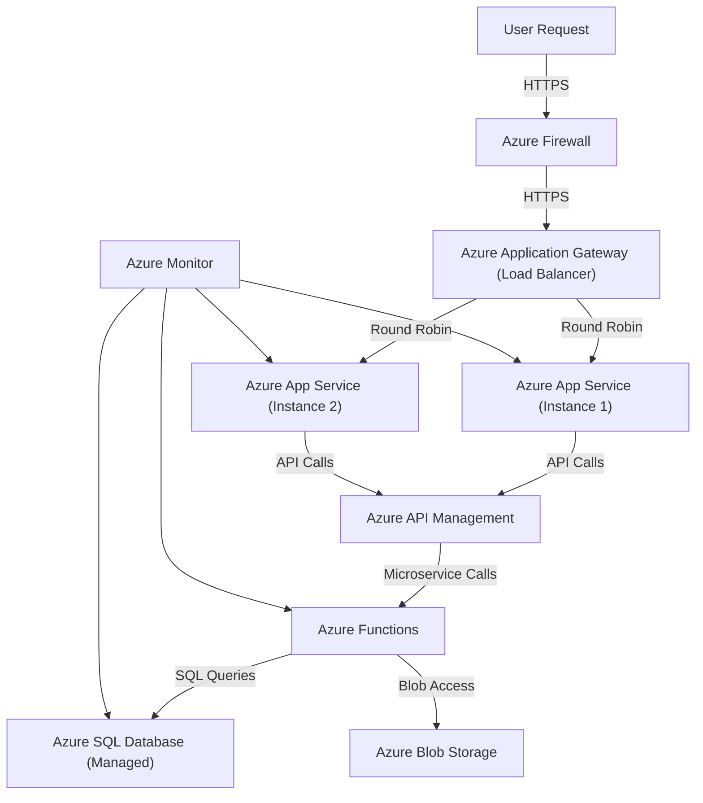

# Lab 6 - Refactoring a Legacy Application for Cloud-Native Deployment on Azure

## Scenario

A company is currently running a **monolithic web application** on a Windows Server 2019 virtual machine (VM) hosted in Azure. The company wants to modernize the application by refactoring it into a cloud-native solution that leverages Azure services.

My task is to refactor the application and migrate it to an Azure-based architecture, utilizing **Azure App Services, Azure Functions, Azure SQL Database, and Azure Storage** to achieve a more scalable and cost-effective solution.

## Monolithic Architecture

Below is one possible monolithic architecture for this web application.

- **Firewall**: Protects against unauthorized access.
- **Load Balancer**: Distributes traffic between frontend VMs.
- **Frontend VMs**: Hosts the web UI and API gateway.
- **Backend VMs:** Handles business logic and communicates with databases.
- **SQL Server VMs**: Hosts the relational database.
- **Local Storage**: Stores static assets and logs on VM disks.
- **Job Scheduler**: Runs background processing tasks inside VMs.

## Assessment of Existing Architecture

Firstly, we need to understand our digital estate. Assessment should be made to clear which parts of the service should be slightly modernized and which parts can be replaced by PaaS services. We could identify the challenges of this monolithic application. If necessary, we can use Azure Migrate to give some migration recommendations or perform dependency analysis.

### **Challenges:**

- **Not cost-effective**: Running multiple VMs may incurs high costs.
- **Scalability issues:** Requires manual scaling and additional VMs for load balancing.
- **High operational cost:** Managing multiple VMs leads to unnecessary overhead. 
- **Limited fault tolerance:** Single VM increases the risk of failures.
- **Inefficient logging & monitoring:** Difficult to track application performance.

## Refactored Cloud-Native Architecture

Azure provided a variety of solutions to run a cloud-native application with high availability, monitor service, and auto-scaling. When we migrate our application to Azure Cloud-Native Services, we gain better scalability, cost-efficiency and resilience.

### **New Setup:**

- **Azure Firewall**: Protect app service from unauthorized access
- **Load Balancer/Azure Application Gateway:** Routing traffic between app instances.
- **Frontend:** Azure App Service (Managed hosting for web applications--PaaS)
  - Azure App Service can host web apps, mobile back ends and RESTful APIs in most of the well-known programming language stacks and can free our hands from managing infrastructure manual scaling and high availability configurations.
- **Database:** Azure SQL Database (Fully managed cloud SQL solution--PaaS)
  - Azure SQL Database runs the latest stable version of the SQL Server database engine and patched OS with 99.99% availability. With the Azure SQL Database, we can create a highly available and high-performance data storage layer for the applications and solutions in Azure.
- **Background Jobs:** Azure Functions (Serverless event-driven execution--PaaS)
  - Suit for building web APIs, respond to database changes, manage message queues, and more. We only need to focus on the code, and Azure Functions will handle the rest. We can use this to connect Frontend service to backend databases, deal with HTTP requests, or handle some other jobs.
- **Static Content & Logs:** Azure Blob Storage (Durable, scalable storage--PaaS)
  - Object storage solution for the cloud, optimized for storing massive amounts of unstructured data, can help store app logs and other unstructured files.
- **Monitoring & Logging:** Azure Monitor
  - Azure Monitor can collect, analyze, and responding to monitoring data from cloud and on-premises environments. This can maximize the availability and performance of our applications and services.

### **Architecture Diagram (After)**

## Refactoring Strategy

### **Step 1: Breaking Down the Monolithic Application**

- **Frontend & API Separation:** 
  - Break frontend API into separate microservices, create their own Git repositories.
  - Identify environment variables for each App Service. 
- **Database Migration:** 
  - Transition from VM-hosted SQL Server to Azure SQL Database.
  - Identify connection strings for each service.
- **Background Jobs Refactoring:** 
  - Check if code needs to refactor when moving to Azure functions because if the code format is not conform with the function version, there'll be issues when deploying the function.
- **Storage Optimization:** 
  - Shift static assets and logs to Azure Blob Storage.

### **Step 2: Implementing Changes**

- #### **Deploy Frontend to Azure App Service**

  - Create an Azure App Service instance.

  - Deploy each microservices on Azure App Service by connect these services with their own Git repositories.

  - Configure environment variables and security settings.

  - Extract API logic and expose it via Azure API Management (APIM).

- #### **Migrate Database to Azure SQL Database**

  - Create an Azure SQL Database instance with a replicated read-only secondary instance.

  - Use Azure Database Migration Service to transfer data.

  - Update connection strings in the application.

- #### **Store Static Content & Logs in Azure Blob Storage**

  - Create an Azure Blob Storage container.

  - Configure CORS and security settings.

  - Update the application to fetch content from Blob Storage.

- #### **Implement Auto-Scaling & Monitoring**

  - Configure Auto-Scaling Rules for Azure App Service based on traffic.

  - Enable Azure Monitor & Application Insights for full observability.

  - Set up alerts for database performance & cloud service availability.

## Optimization and Testing

- ### **Auto-Scaling Configuration**

  - Enable horizontal scaling in Azure App Service.

  - Configure Azure SQL Database tier for performance.

- ### **Logging & Monitoring Setup**

  - Enable Azure Monitor & Application Insights.

  - Configure alerts for performance anomalies.

- ### **Performance & Reliability Testing**

  - Conduct load testing to validate scalability.

  - Perform failover testing for high availability.