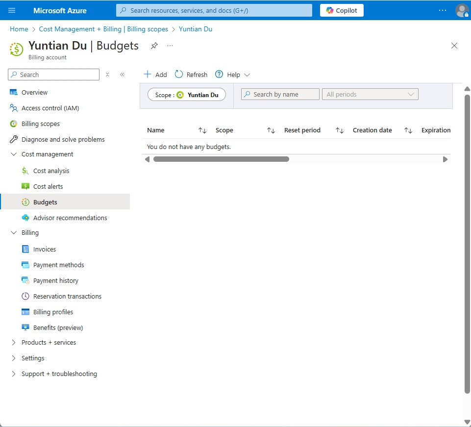
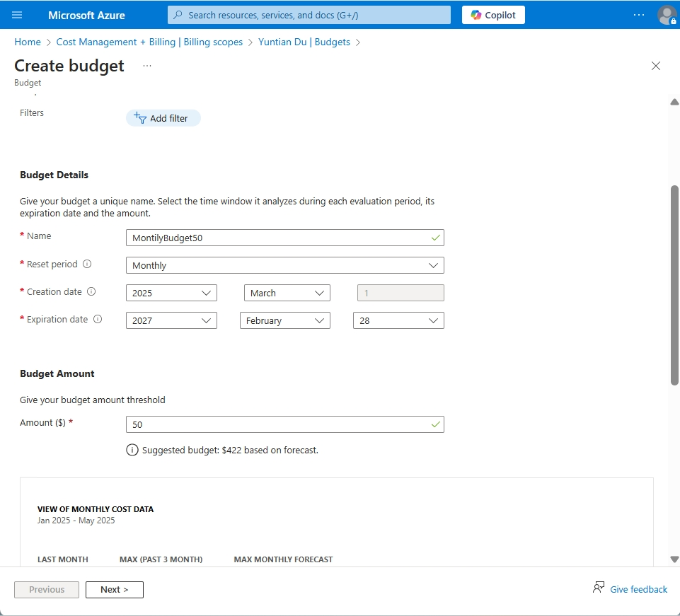
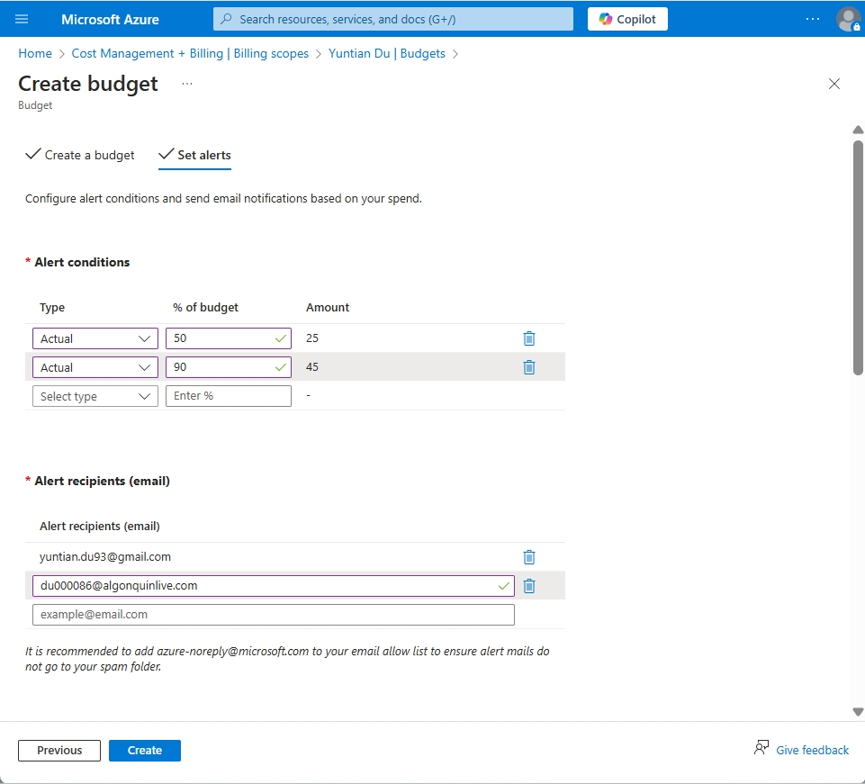
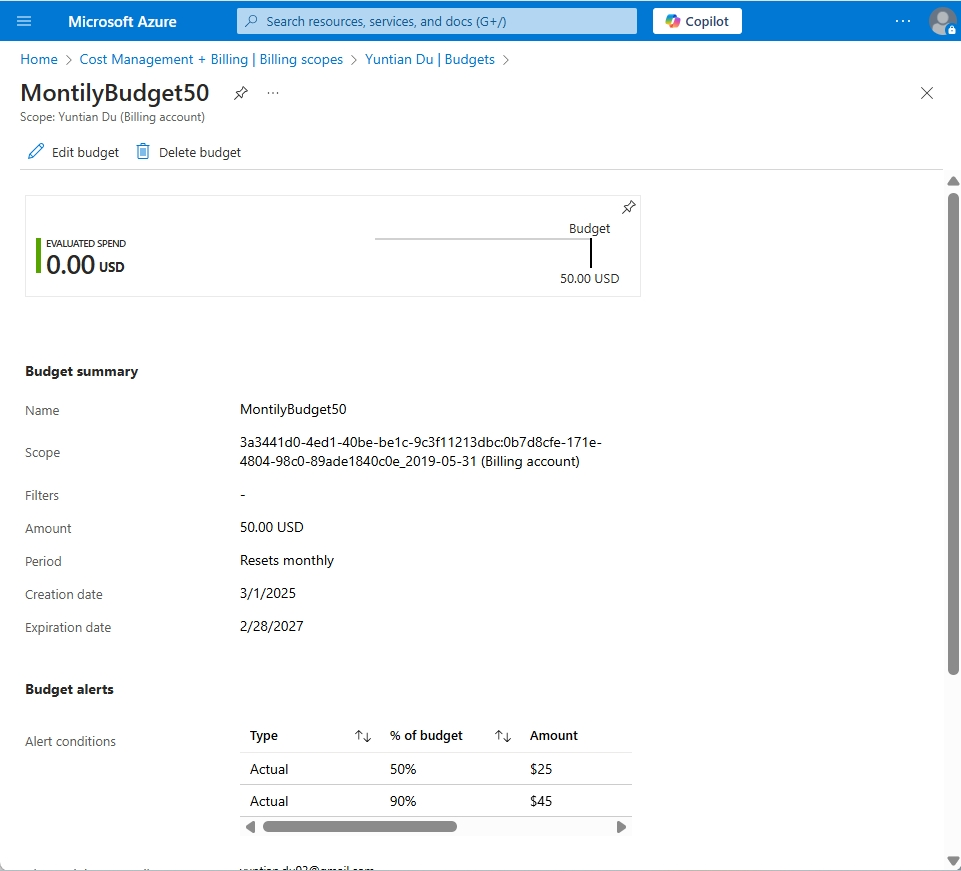

# Creating Budgets and Alerts in Azure

### Step 1: Create a Budget

1. **Navigate to Cost Management + Billing**:

   - In the left-hand menu, select **"Cost Management + Billing"**.
   - Click our own account.
   - Choose **"Budgets"** from the submenu.
     

2. **Add a New Budget**:

   - Click on the **"+ Add"** button to create a new budget.

3. **Configure Budget Details**:

   - **Name**: MonthBudget50.

   - **Scope**: Yuntian Du.

   - **Reset Period**: Monthly.

   - **Start Date**: Choose the date when the budget should start.

   - **Expiration Date**: Set an optional end date for the budget.

   - **Budget Amount**: 50.

     

4. **Proceed to Alerts**:

   - Click **"Next"** to configure alert conditions.

### **Step 2: Set Alerts for 50% and 90% Usage Thresholds**

1. **Configure the First Alert**:

   - **Threshold Type**: Actual.
   - **Alert Trigger (%)**: 50.
   - **Email Recipients**: My email address.

2. **Configure the Second Alert**:

   - **Threshold Type**: Actual.

   - **Alert Trigger (%)**: 90.

   - **Email Recipients**: My email address.

     

3. **Finalize the Budget**:

   - Review all configurations and click **"Create"** to finalize the budget and alert settings.

### **Step 3: Take Screenshots of the Budget and Alert Settings**

